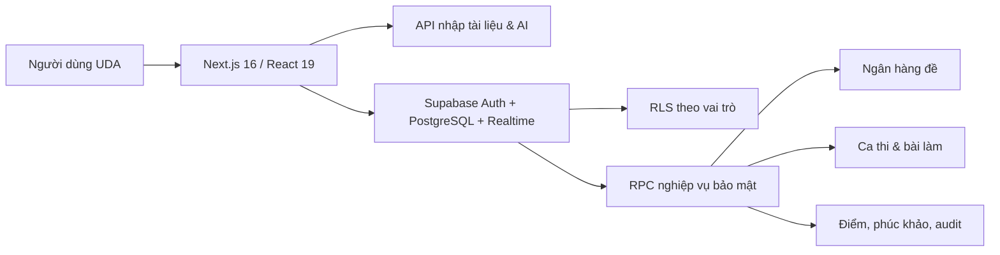
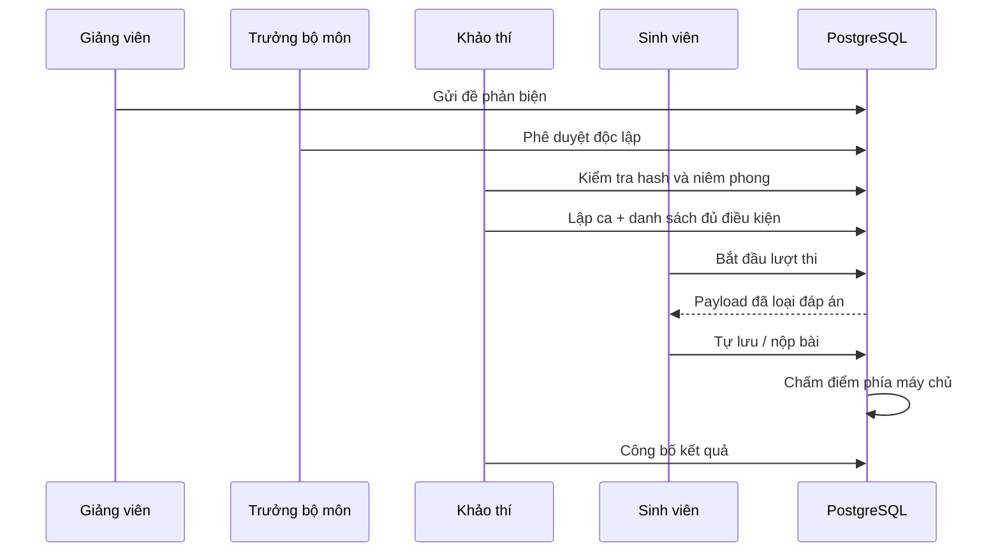

# Kiến trúc UDA Assessment Hub

## Mục tiêu

Hệ thống hỗ trợ ba luồng tách biệt: học–ôn tập, kiểm tra tương tác và thi chính thức có kiểm soát. Dữ liệu đề thi chính thức chỉ được sử dụng sau chu trình ra đề → phản biện → phê duyệt → niêm phong.

## Kiến trúc logic

## Thành phần

| Tầng | Công nghệ | Trách nhiệm |
|---|---|---|
| Giao diện | Next.js, React, Tailwind CSS | Nhập đề, học, thi, giám sát, quản trị |
| API | Next.js Route Handlers | Trích xuất PDF/DOCX, gọi AI, giới hạn tốc độ |
| Dữ liệu | Supabase PostgreSQL | Đề, lớp, phiên thi, bài làm, điểm và nhật ký |
| Danh tính | Supabase Auth | Đăng ký, đăng nhập, phiên người dùng |
| Phân quyền | PostgreSQL RLS + RPC | Kiểm soát truy cập và thao tác theo vai trò |
| Realtime | Supabase Realtime | Phòng thi đấu trực tiếp và trạng thái người chơi |
| Triển khai | Vercel | Web production và API serverless |

## Nguyên tắc an toàn

- Maker–checker: người ra đề không được tự duyệt.
- Người niêm phong độc lập với người ra đề và phản biện.
- Đáp án đúng không gửi xuống trình duyệt trong bài thi chính thức.
- Chấm điểm thực hiện trong PostgreSQL; sinh viên chỉ thấy điểm sau công bố.
- Điều kiện dự thi được xác nhận trước ca thi.
- Tự lưu bài; ghi nhận chuyển tab, mất/kết nối lại và biên bản giám thị.
- Thay đổi điểm cần đề nghị và phê duyệt bởi hai người khác nhau.
- Các quyết định quan trọng ghi vào `audit_logs`.

## Vai trò

`student`, `lecturer`, `department_head`, `assessment_officer`, `proctor`, `training_officer`, `quality_officer`, `admin`.

## Luồng thi chính thức

